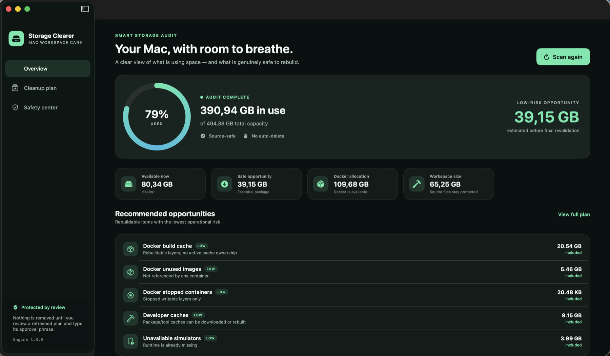

<p align="center">
  
</p>

<h1 align="center">Storage Clearer</h1>

<p align="center">
  See what is using your Mac's space. Remove only developer clutter that is safe to rebuild.
</p>

<p align="center">
  <a href="https://clear.knasoftware.com/?utm_source=github&utm_medium=repository&utm_campaign=preview_1"><strong>Product site</strong></a>
  ·
  <a href="https://github.com/khiemnd777/storage-clearer/releases/download/v1.0.0-preview.1/Storage-Clearer-1.0.0-arm64.zip"><strong>Download for macOS</strong></a>
  ·
  <a href="https://github.com/khiemnd777/storage-clearer/releases/tag/v1.0.0-preview.1">Release notes</a>
</p>

<p align="center">
  
</p>

> **Preview:** The current Apple silicon build supports macOS 13 or later and is unsigned. On first launch, Control-click the app, choose **Open**, then confirm **Open**.

`storage-clearer` is a Bash 3.2-compatible storage engine with a native SwiftUI macOS app. It audits disk usage, explains likely causes through a reason matrix, and builds a reviewable cleanup plan before anything is deleted.

The default command is a read-only audit. Cleanup is only available through the interactive `run` command after the user selects a package and enters the exact approval phrase shown by the program.

## Why this exists

macOS can group Docker data, Xcode Simulator runtimes, developer caches, Time Machine snapshots, and other files under the broad **System Data** category. Generic cleanup commands often hide what they remove and may mix rebuildable files with valuable data.

This tool separates the workflow into four explicit stages:

1. **Triage** — collect storage facts without changing the machine.
2. **Explain** — show the evidence, risk, policy, and recommendation for each category.
3. **Plan** — preview the exact cleanup actions in Package A, Package B, or a custom selection.
4. **Run** — revalidate destructive targets and execute only after interactive approval.

## Quick start

```bash
git clone https://github.com/khiemnd777/storage-clearer.git
cd storage-clearer
chmod +x storage-clearer.sh

./storage-clearer.sh audit
./storage-clearer.sh explain all
./storage-clearer.sh plan B
./storage-clearer.sh run
```

Running the script without arguments is equivalent to `audit`.

## Native macOS app

The commercial desktop experience adds a storage dashboard, reviewed Package A/B plan builder, risk labels, explicit exclusions, and a dedicated safety center. Cleanup runs in a protected in-app session: the engine refreshes the audit, displays the exact plan, waits for its matching approval phrase, revalidates changing targets, streams progress into the app, and preserves the execution log.

Run the app directly during development:

```bash
swift run StorageClearerApp
```

Build a distributable `.app` bundle:

```bash
chmod +x scripts/package_app.sh
./scripts/package_app.sh
open "dist/Storage Clearer.app"
```

The generated bundle includes the storage engine and product icon. It is unsigned; external distribution requires Developer ID signing and Apple notarization.

The product site is published at [clear.knasoftware.com](https://clear.knasoftware.com). See [the launch plan](docs/LAUNCH_PLAN.md) for the signed release, distribution, and hosting workflow.

## Commands

```text
./storage-clearer.sh audit
./storage-clearer.sh explain [all|ACTION-ID]
./storage-clearer.sh reason [all|ACTION-ID]
./storage-clearer.sh plan [A|B]
./storage-clearer.sh run [A|B]
./storage-clearer.sh app-run [A|B]
./storage-clearer.sh help
./storage-clearer.sh version
```

| Command | Changes data? | Purpose |
| --- | --- | --- |
| `audit` | No | Collect facts and display the storage summary and reason matrix. |
| `explain` / `reason` | No | Show evidence, impact, policy, and recommendation for one or all action IDs. |
| `plan A` / `plan B` | No | Preview the actions included in a predefined cleanup package. |
| `run [A\|B]` | Potentially | Select a package in Terminal, review the plan, approve it, revalidate targets, and execute. |
| `app-run [A\|B]` | Potentially | Private native-app process protocol with the same exact approval and revalidation gates. |

## Cleanup options

### Package A — conservative

- Docker stopped containers.
- Docker images no longer referenced by a container.
- Docker build cache.
- Rebuildable npm, Bun, Gradle, Go, Pub, pnpm, pip, node-gyp, and Playwright/Playwright Go caches.
- Simulator devices whose runtimes are no longer available.

### Package B — reviewed machine cleanup

Package B includes Package A and removes older iOS Simulator runtimes while always keeping the newest installed iOS runtime.

Runtime removal uses the official `xcrun simctl runtime delete` API. The script never directly removes system runtime directories with `rm`.

### Custom

Custom mode allows individual actions to be selected. Unused Docker volumes are classified as `HIGH` risk and require an approval phrase containing the additional words `INCLUDING VOLUMES`.

Time Machine local snapshot thinning is a separate `HIGH`-risk Custom action and must run alone. It is available only when the audit can name at least one local Time Machine snapshot. The user supplies a whole-number GiB target and an urgency from `1` to `4`, reviews the exact `tmutil` command, and types a dedicated phrase such as:

```text
THIN TIME MACHINE SNAPSHOTS 40 GIB
```

The tool re-lists the snapshots and aborts if the approved target signature changed. It records snapshot inventories before and after the operation and never invokes `sudo`, `rm`, `deletelocalsnapshots`, or direct APFS snapshot deletion.

## Data excluded from Package A and Package B

The predefined packages never delete:

- Docker volumes.
- Browser profiles or website data.
- Source code or generated data inside `~/Works`.
- Codex session history in `~/.codex/sessions`.
- Photos, Mail, Messages, MobileSync backups, or Trash.
- APFS or macOS snapshots.

Browser data, `~/Works`, and Codex sessions may appear in the reason matrix for review, but they do not have automatic cleanup actions.

Time Machine/APFS snapshot inventory and selected Claude/Codex cache locations also appear in the matrix as read-only observations. Snapshot names and embedded timestamps are shown when `tmutil` permits access. Their reclaimable size is intentionally reported as `unknown` because macOS manages snapshot storage dynamically.

Apple explains that local snapshots provide restore points and are normally removed automatically as they age or when space is needed. Use manual thinning only after reviewing that recovery tradeoff. See [About Time Machine local snapshots](https://support.apple.com/en-ca/102154).

## Safety model

- Cleanup refuses to run under `sudo` or as the `root` user.
- `audit`, `explain`, `reason`, and `plan` are read-only.
- `run` requires an interactive terminal and an exact typed approval phrase; `app-run` accepts that phrase only through the native app's private process pipe.
- Cache deletion is limited to a fixed allowlist of paths inside the current user's home directory.
- Cache targets that are symbolic links are rejected.
- Go caches are cleaned with `go clean -modcache -cache -testcache`; permissions are not changed to force removal.
- Simulator runtime UUIDs and Docker volume targets are revalidated immediately before execution.
- Docker cleanup uses official prune commands and never directly deletes `Docker.raw`.
- Snapshot inventory and AI assistant caches remain report-only findings. The distinct `time-machine-thin` action is Custom-only, requires its own approval phrase, and cannot be combined with other actions.
- Time Machine thinning uses only `tmutil thinlocalsnapshots`; target parameters and snapshot names are revalidated immediately before execution.
- Every cleanup command is recorded under `~/Library/Logs/storage-clearer/`.
- Free space is measured before and after execution.

Review every plan before approving it. Close Xcode, Simulator, and active build processes before running cleanup.

## Audit animation

When stdout and stderr are connected to an interactive terminal, long audit phases display a spinner so the user can see that collection is still running.

When output is redirected or the script runs in CI, the spinner automatically becomes a static status line. Animation can also be disabled explicitly:

```bash
SC_NO_ANIMATION=1 ./storage-clearer.sh audit
```

## Requirements and permissions

- macOS with the system Bash 3.2 or a compatible Bash version.
- Docker Desktop is optional, but it must be running to audit or clean Docker objects.
- Xcode and `xcrun simctl` are optional and only required for Simulator inspection and cleanup.
- Full Disk Access for the surface performing cleanup (Storage Clearer or Terminal) is recommended for a more complete audit and may be required by `tmutil` on some macOS versions.

After Docker prune operations, space is released inside the Docker VM immediately. The free-space value reported by macOS may update later, after Docker Desktop performs TRIM or compaction on `Docker.raw`.

## Tests

```bash
./tests/test_storage_clearer.sh
```

The test suite checks shell syntax, package policy, cache allowlist guards, Time Machine snapshot parsing, thinning parameter validation, dedicated approval, target signatures, the native app approval protocol, fully mocked execution, runtime identifiers, the executable action registry, help output, and spinner fallback behavior. It never runs a real cleanup.

## Contributing

Issues and pull requests are welcome, especially for additional macOS storage categories, safety reviews, and Bash 3.2 compatibility improvements.

See [CONTRIBUTORS.md](CONTRIBUTORS.md) for project acknowledgements.

The read-only Time Machine and AI cache inventory was inspired by [Issue #1](https://github.com/khiemnd777/storage-clearer/issues/1), contributed by [Rick Segal (@hellosimplerick)](https://github.com/hellosimplerick).
